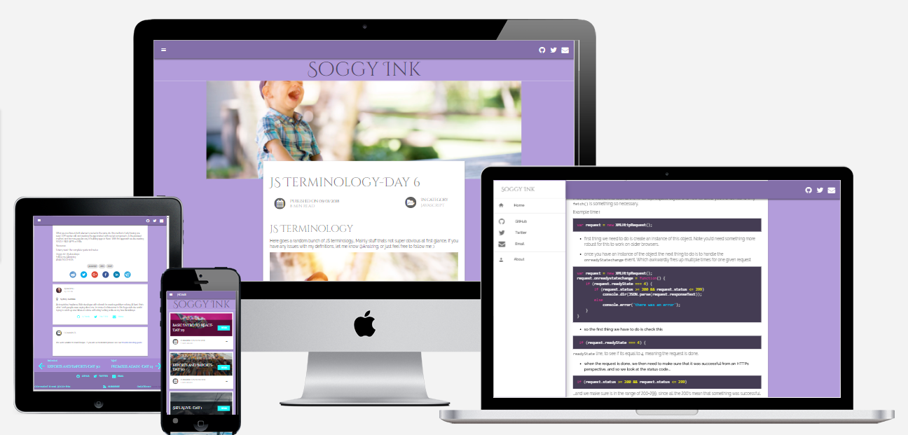
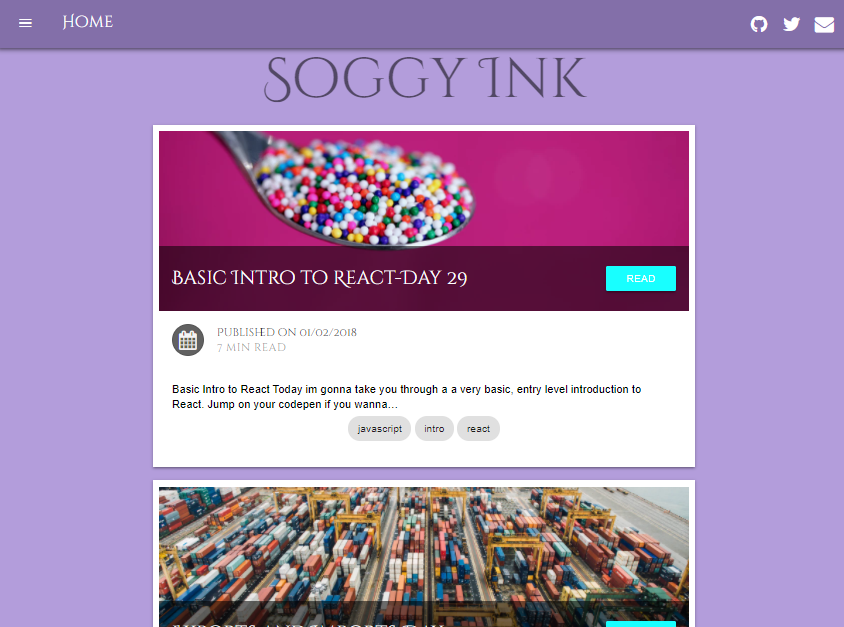

# Soggy Ink
## My personal blog built with Gatsby/React/GraphQL

This is my personal blog filled with reports on what I'm learning (that glorious never ending journey), with a focus on Javascript and its ecosystem, and how not to throw your laptop onto oncoming traffic in a fit of rage... Just kidding, I cant tell you how to deal with your  demons, that's your problem. If you love javascript and if you are getting started check out the web app for an informative read and some mild swearing. [Soggy Ink](https://soggy-ink.surge.sh/)
I built this blog web app using Gatsby, which uses React and GraphQL and a lot of javascript obviously. Enjoy!

# This web app was bootstrapped with Gatsby Material Starter

A blog starter with Material design in mind for [Gatsby](https://github.com/gatsbyjs/gatsby/).

[Demo website.](https://vagr9k.github.io/gatsby-material-starter/)

